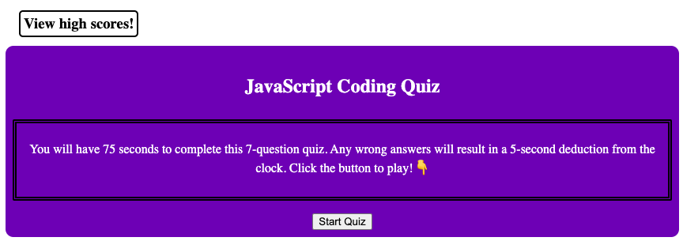
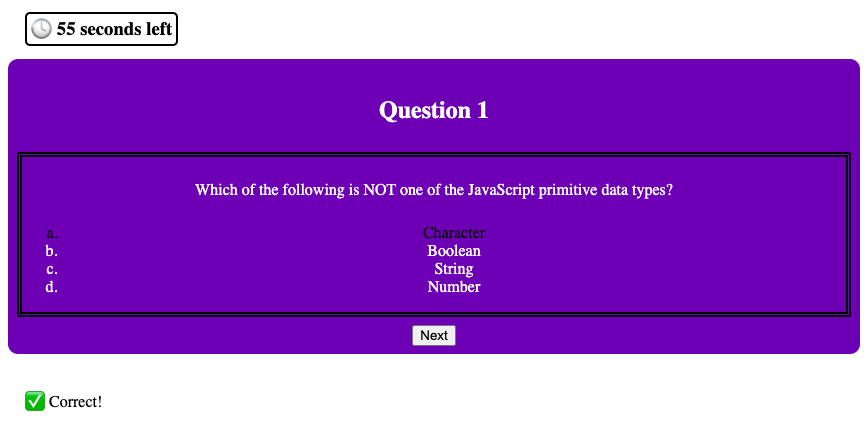
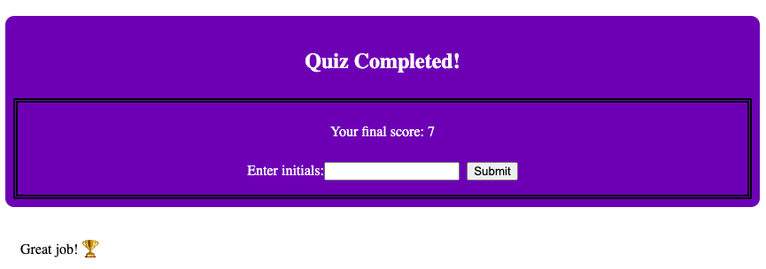

# JavaScript Coding Quiz

## Description

The purpose of this project was to apply JavaScript and web API fundamentals to build a coding quiz application. During the development process, I learned how to apply document object methods and properties, utlilize event handlers, alter attributes of HTML elements using JavaScript, and write more complex JavaScript functions than I was previously able to. Furthermore, this application serves as a practice tool for technical assessments. As I cover more topics in class, I will continue to update this application with more content.

## Usage

To access this application, visit the following URL: [https://rpecuch.github.io/javascript-quiz](https://rpecuch.github.io/javascript-quiz).

To start the quiz, click on the "Start Quiz" button.

Users will be taken through 7 multiple-choice questions as time permits.

At the end of the quiz, the user will be prompted to enter their initials to save their score. To view the list of high scores, click on the "View High Scores" button in the top left corner.

## License

Please refer to the license in the repo.
